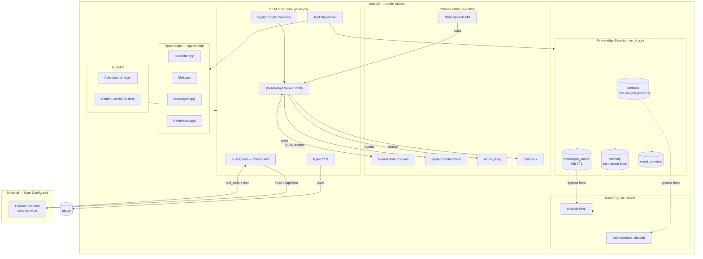
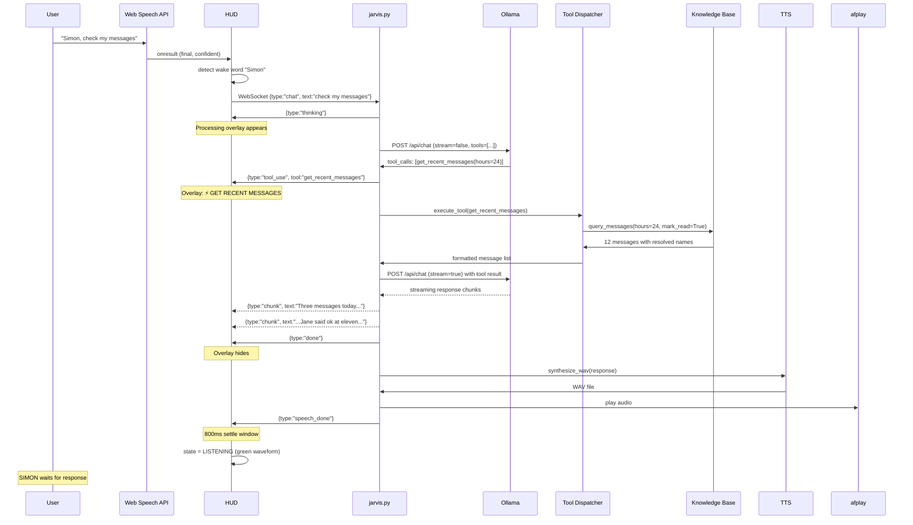
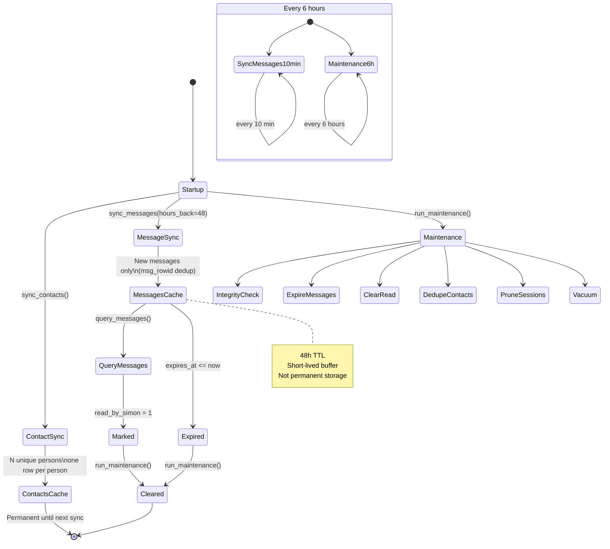
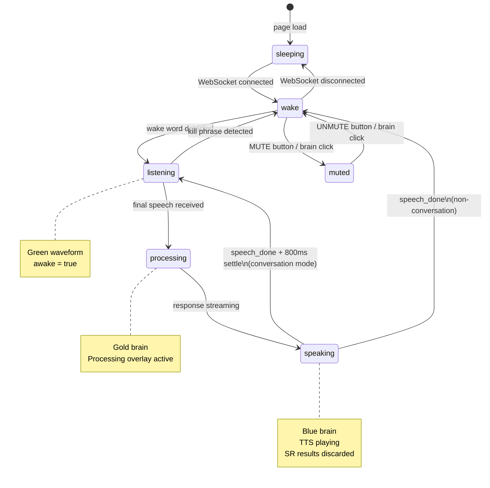

# S.I.M.O.N. System Diagrams

Mermaid diagrams that render on GitHub. Copy any block into a `.md` file surrounded by ` ```mermaid ` fences.

---

## System Architecture



---

## Voice Command Flow



---

## Knowledge Base Lifecycle



---

## HUD State Machine


